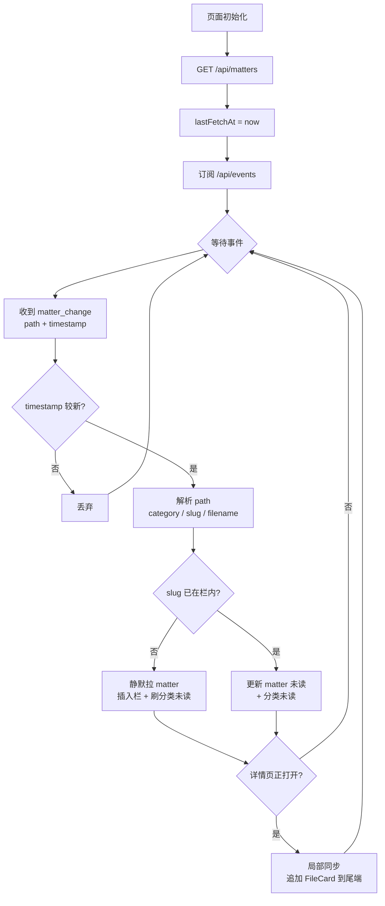

# 支持 matter 维度的 Streamable HTTP 实时刷新

我们需要给 Pivot Web 客户端增加一个轻量级的实时刷新机制，使得当其他用户新建 matter、追加文件、变更状态或追加评论时，当前在线用户的 matter 列表与 matter 详情页能够较快感知到变化，并正确显示最新内容、未读状态和按钮可见性矩阵。

系统已有 matter 列表（`GET /api/matters`）、详情页（`GET /api/matters/{id}`）、未读与收藏（P4.5 已落到 matter）等接口，增加一层基于 **Streamable HTTP（fetch + ReadableStream）** 的变更通知即可：服务端只告诉前端"某个 matter 发生了变化"，前端静默调现有 matter 接口刷新。

服务端事件总线复用 matter-migration-plan §P2 已规划的 `server/events.py`（结构化日志 + 进程内 pub/sub）。Streamable HTTP 推送是它的一个新消费者，与 AI-monitor 共享同一个 emit 点，writer 层不重复埋点。已废弃的 thread 概念 / 旧 `/api/threads/*` 路由不在推送覆盖范围内。

## 设计方案

- 服务端推送订阅适配器（`BroadcastHub`）挂在 `server/events.py` 已埋的 emit 链路上，把事件以 SSE 帧格式 fanout 给已订阅的客户端（浏览器、PAT 客户端等）。**推送层只关心"哪个文件 / 哪个 matter 发生变化"，不关心变化的细分语义** —— 一次 publish = 一条事件帧。
- 新增 `GET /api/events` Streamable HTTP 流接口，**同时支持 session cookie 和 `Authorization: Bearer <PAT>` 鉴权**（fetch 可设自定义 header，此前 EventSource 方案的"PAT 客户端收不到"限制被解除）。响应 `Content-Type: text/event-stream`，按 SSE 帧编码逐帧 chunked 输出。
- 客户端可通过 `Last-Event-ID` 请求头声明上次收到的事件序号；服务端维护一个进程内环形缓冲（容量 N，建议 256），命中即重放，不命中走全量兜底刷新。
- **事件 kind 统一为一个 `matter_change`**，载荷只剩 `path` + `timestamp`（Unix 毫秒）：

  ```
  id: 1234
  event: matter_change
  data: {
    "path": "discussions/<category>/<matter_id>/<filename>",
    "timestamp": 1745398260000
  }
  ```

  | path 含义 | 触发场景 |
  |---|---|
  | 首篇文件路径 | matter 创建 |
  | 新落盘文件路径 | think / act / verify / result / insight 追加（`apply_status_change` / `apply_result` 随文件内嵌触发，不独立转发） |
  | 评论挂载的 target_file 路径 | matter 内追加评论 |

  > 业务语义（创建 / 追加 / 评论 / 状态变更）由前端从 `fetchMatter()` 后的 diff 反推：`matter_id` 是否本地未见、`timeline.length` 是否变化、对应 file 的 `comments.length` 是否变化、`current_status` 是否变化。服务端 `events.py` 的 5 类细分 emit 全部保留给 AI-monitor；推送适配器只转发其中 `create_matter` / `append_file_item` / `append_comment` 三类。

- 前端收到事件后，按 path 解析出 `(category, matter_id, filename)`，再后台静默刷新现有 matter 接口：
  - 必做：`fetchMatters()` 刷列表（未读 / 状态徽章 / 顺序）+ `fetchInbox()` 刷收件箱
  - 若用户当前正打开该 matter 详情页：额外 `fetchMatter(matter_id)`
  - 拉到的新 `matter.current_status` 若与上次不同：重新评估按钮可见性矩阵（生成 Result / 生成 Insight / + think / + act / + verify 按 `ALLOWED_TYPES_BY_STATUS` 收紧或放开），并校验当前 inline 草稿（`pendingCreate`）是否仍合法 —— 不合法时 toast + 关闭草稿；正文已落 `drafts` 表的草稿仍保留，用户可手动迁移
  - 选做（微 UX）：按 path 末段命中的 FileCard 做短暂高亮；评论新增（diff 出 `comments.length` 涨）时在对应卡片显示小红点
- 如果刷新结果没有实际变化，页面不应闪烁、不应重置滚动位置，也不要出现 loading 骨架。
- 如果页面处于后台、流连接断开或移动端 WebView 暂停连接，则在页面回到前台时（`visibilitychange` / `pageshow` / `focus` 任一）补做一次静默全量刷新，作为可靠兜底。

### 服务端数据结构

```python
# server/events/broadcast.py
@dataclass
class MatterEvent:
    id: int          # 单调递增；对应 SSE 帧的 id 行
    path: str        # discussions/<category>/<matter_id>/<filename>
    timestamp: int   # Unix epoch ms

class BroadcastHub:
    _subscribers: set[asyncio.Queue[MatterEvent]]  # 每个活跃连接一条 queue
    _ring: deque[MatterEvent]                       # 环形缓冲，maxlen=256，供 Last-Event-ID 重放
    _next_id: int                                   # 单调 id 生成器
    _max_queue: int = 64                            # 单订阅者 backlog 上限；溢出即踢
    _lock: asyncio.Lock                             # 保护 _subscribers 增删
```

### 触发流程（writer → 推送适配器 → 客户端）

```
publish.py
  publish_matter_create / publish_matter_append / publish_matter_comment
        │
        ▼
  server/events.py  emit(kind, payload)                    [matter-migration §P2 已埋]
        │
        ├──> AI-monitor 订阅                                按 5 类 kind 细分消费
        └──> BroadcastHub.on_event(...)                     推送适配器（新增）
               │
               │ 仅订阅 create_matter / append_file_item / append_comment 三类
               │ apply_status_change / apply_result 不独立转发（必随 file 写入）
               ▼
          构造 MatterEvent(id=next_id, path, timestamp)
               │
               ├──> 入 _ring（环形缓冲，供 Last-Event-ID 重放）
               └──> for q in _subscribers: q.put_nowait(event)
                                                │
                                                │ QueueFull → 踢掉慢订阅者
                                                ▼
                                  /api/events 连接 coroutine 从 q.get() 拿到事件
                                                ▼
                                  按 SSE 帧格式 yield "id:.. \nevent:.. \ndata:..\n\n"
                                                ▼
                                  客户端 fetch ReadableStream 读字节，解帧 → handler
```

写路径关键性质：

- `publish` 用 `put_nowait`，不等待消费者，**永不阻塞 writer**
- 一次 publish = 一次 `BroadcastHub.on_event` = 一条 MatterEvent 入 ring + fanout（去重在适配器侧完成）
- Hub 不持久化、不夸进程；进程重启后未消费的事件丢失，由客户端重连后的全量兜底刷新覆盖

## 推送消费流程

前端处理推送事件采用"时间戳幂等 + 增量同步"，避免重复刷新与漏刷：

- 每次 `GET /api/matters`（列表拉取）成功后，记录本地 `lastFetchAt = Date.now()`（Unix ms）
- 收到 `matter_change` 事件时，先比较 `event.timestamp` 与 `lastFetchAt`：
  - `≤` → 列表请求已覆盖该变化，丢弃
  - `>` → 解析 path，按 slug 在左侧栏是否存在分流处理
- 单个 matter 详情拉取（`GET /api/matters/{slug}`）**不更新** `lastFetchAt`，避免漏掉其它 matter 的事件



> `局部同步` 优先走单卡接口（见下文"配套服务端改动建议"），单卡接口未上线前 fallback 到 `GET /api/matters/{slug}` 全量拉。

### 仅按 slug 拉整 matter 的弊端

`GET /api/matters/{slug}` 一次性返回整个 timeline + 所有 body。每条事件都拉全量，三层 O(N) 浪费：

- **网络**：body 重传，timeline 越长越亏
- **服务端 IO**：`_render_item` 把所有 MD 重读一遍
- **前端**：本来只需追加一张卡，被迫整 matter diff + 状态/按钮重算

### 配套服务端改动建议

新增 `GET /api/matters/{matter_id}/files/{filename}`，仅返回该 file item + matter 顶层快照（`current_status` 等）：

```
GET /api/matters/{matter_id}/files/{filename}
  → {
      "item": TimelineItem,             // 由 _render_item 已有逻辑产出
      "matter_snapshot": {
        "current_status": "...",
        "updated_at": "..."
      }
    }
```

这样推送触发的局部同步路径变成：

- 解析 `event.path → (category, slug, filename)`
- 仅当 `filename` 属于新文件（diff 本地 timeline 后未命中）时调 `GET /api/matters/{slug}/files/{filename}`
- 拿到单卡 `item` 直接 `append` 到时间轴尾端
- `matter_snapshot.current_status` 与本地不同时再触发按钮可见性矩阵重算 + 草稿合法性校验

