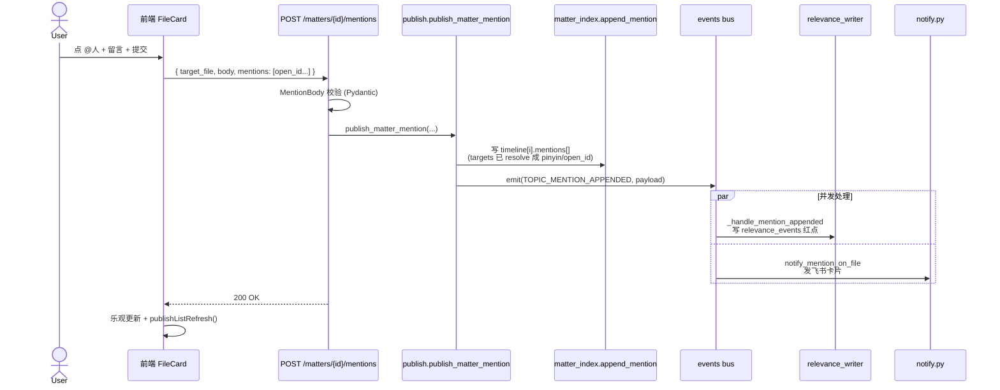
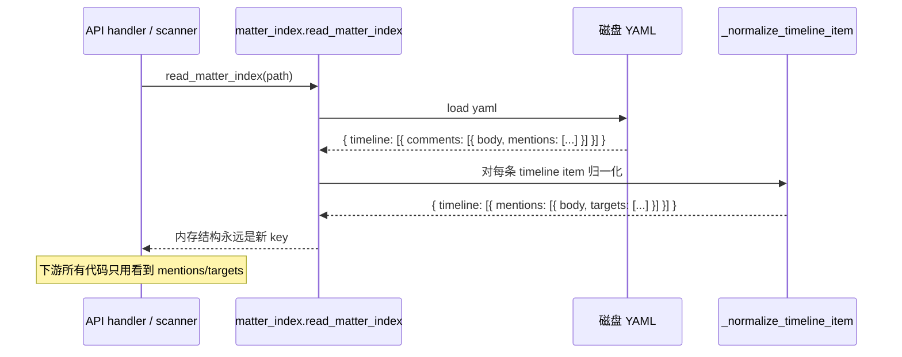

# matter index中comments → mentions 重命名：技术设计方案

## 一、需求背景

现在 matter index 的 timeline 里挂着一个 `comments` 数组，每条 comment 自己又带一个 `mentions` 数组。这个结构其实一直在干两件事：

1. 留一段话、@ 几个人，希望对方看到——这是**协作信号**。
2. 想对这个文件给个评价、做个判断——这是**评价标注**。

两件事被塞进了同一个字段，时间长了大家都心知肚明它叫什么不重要、反正用着用着就乱了。dengke 在 003_dengke_think 里把这事挑出来了：先把第一类——纯协作信号——独立出来叫 `mention`，让语义干净一点。第二类（评价标注）以后用一个新的 `annotation` 概念来承载，不在本期范围。

所以这一期要做的事其实很窄：**把 `comments` 改名为 `mentions`，把内层的 `mentions` 改名为 `targets`**。除此之外不动任何行为。

为什么这么个简单的事还要写设计文档？因为 `comments` 这个词在代码里出现的位置非常多——后端 schema、Pydantic body、HTTP 路由、事件总线 topic、飞书通知方法、MCP tool schema、前端类型、组件里全是。一动就是几十处，加上历史 YAML 还堆了一大堆 `comments:` 数据，怎么改不出乱子需要先把节奏定清楚。

## 二、目标

讲三件事就够了：

- **写侧契约一刀切**：HTTP 路由、Pydantic 模型、事件 topic、MCP schema 全部直接改名，不留 alias、不做兼容转发。前后端**同批部署**，MCP 集成方已提前同步切换计划。
- **读侧做兼容**：matter_index reader 同时认 `comments` 和 `mentions` 两种 key，老 YAML 不需要迁移就能正常读出来、渲染、跑通知。
- **零行为变化**：已读、红点、@通知、AI 复盘等流程，行为跟改名前一模一样。

不在本期范围的事（这里再次强调，避免 PR 失控）：annotation 字段、AI 派生评分、评价对象限定、`mention_unread_for_me` 字段名调整。

## 三、技术方案

### 3.1 数据模型怎么变

YAML 上其实就一个改名加一个改名：

```yaml
# 改名前
timeline:
  - file: 002_liuyu_act_xxx.md
    comments:
      - body: "你看看这个方案"
        mentions: [liuyu]

# 改名后
timeline:
  - file: 002_liuyu_act_xxx.md
    mentions:
      - body: "你看看这个方案"
        targets: [liuyu]
```

外层 `comments` → `mentions`，内层 `mentions` → `targets`。**为什么不复用 `mentions` 这个名字到内层**？因为这样会出现 `mentions[].mentions` 这种递归式的怪结构，读代码的人第一眼会犯困。`targets` 直白：被提醒的人是谁。

### 3.2 写侧：直接切，不留兼容

写侧涉及的"对外契约"有四类：

| 契约 | 旧 | 新 | 兼容策略 |
|------|----|----|---------|
| HTTP 路由 | `POST /api/matters/{id}/comments` | `POST /api/matters/{id}/mentions` | 直接改名，无 alias |
| Pydantic body | `CommentIn` / `CommentBody` | `MentionIn` / `MentionBody` | 直接改名 |
| 事件总线 topic | `TOPIC_COMMENT_APPENDED` | `TOPIC_MENTION_APPENDED` | 直接改名 |
| MCP tool schema | `comment` / `comments` 参数 | `mention` / `mentions` 参数 | 直接改名 |

四个都不留 alias 是为了避免一个常见陷阱：兼容代码一旦上线就很难删掉，每隔一段时间就会有人问"那个旧的还在用吗"，最后变成永久负担。这次直接干净切换，代价是前后端必须同批发；MCP 集成方已提前打过招呼、约好了切换时间窗。

### 3.3 读侧：双键归一化是唯一的兼容层

写侧虽然干净切了，但磁盘上躺着的几十 / 几百个历史 matter 的 YAML 文件全是 `comments:` 开头的。这些 YAML 是用户的历史数据，不能也不该让它们坏掉。

兼容点放在**唯一的位置**：`server/matter_index.py` 的 reader。读出来之后立即做归一化：

```python
def _normalize_timeline_item(item: dict) -> dict:
    # 老字段在的话，搬到新字段；新字段已经在的话，原样走
    if "comments" in item and "mentions" not in item:
        item["mentions"] = item.pop("comments")
    for m in item.get("mentions") or []:
        if "mentions" in m and "targets" not in m:
            m["targets"] = m.pop("mentions")
    return item
```

这样做的好处：

- **下游所有代码只看到 `mentions` / `targets`**，不需要在 N 处分别处理两种 key。
- 内存里就一种结构，序列化回写出去自然就是新格式（用户改一次 matter，老 YAML 自然升级）。
- reader 是唯一兼容点，未来想清理的时候删一个函数就行。

写侧 validator 那边照常严格——只接受 `mentions` + `targets`，传 `comments` 直接 422。这是因为写侧拿到的请求都是新前端（或新 MCP 客户端）发的，不应该再有老 key。

### 3.4 飞书通知文案

`notify.py` 里凡是出现"评论"的位置改成"提醒"。例如：

- "X 在文件 Y 评论了你" → "X 在文件 Y 提醒了你"
- "X 评论了你的文件 Y" → "X 在你的文件 Y 留言提醒"

具体措辞 PR review 时再敲，本设计只规定方向。

### 3.5 一个反复出现的问题：`mention_unread_for_me` 这个字段名要不要一起改？

不改。这个字段是给前端 timeline item 加的衍生字段，含义是"这条 mention 是否对我未读"。改它意味着前端所有 `c.mention_unread_for_me` 都要跟着动，而且后端 `_inject_relevance` 里产出这个字段的位置也要联动。这一期范围明确不动，避免越改越大。

## 四、时序图

### 4.1 写一条 mention 的端到端流程



### 4.2 读一个老 matter（reader 双键归一化）



老 YAML 在内存里被改写成了新结构；如果接着这次读取触发了一次写回（比如用户在这个 matter 里追加了一条新 mention），落回磁盘的就是新格式，老 YAML 就此自然升级。**不主动批量改写历史文件**——靠用户的自然交互慢慢迁。如果以后想彻底清理 reader 这层兼容代码，到时候跑一次性 rewrite 脚本扫一遍就行。

## 五、影响面速览

只列文件层面的热点，每个文件具体怎么改在实施计划里。

后端：

- `server/matter_validator.py`、`server/publish.py`、`server/api/matters.py`
- `server/notify.py`、`server/events.py`、`server/mcp/schemas.py`
- `server/relevance_writer.py`、`server/relevance_scanner.py`
- `server/matter_index.py`（reader 兼容点的核心位置）

前端：

- `web/src/api.ts`（类型 + API client）
- `web/src/components/matter/FileCard.tsx`、`MentionPopover.tsx`
- `web/src/pages/MatterDetailPane.tsx`
- 其他 grep `comments` / `comment_` 拉出来的所有引用

测试：所有 `*comment*` 测试文件改名 + 断言改 key。

## 六、实施分工

按"做什么"分而不是按"谁来"分（具体到人由 PM 排）。整个改造拆 5 个 Phase，详情在实施计划里，这里给一个分工视角的概览。

| 角色 | 主要职责 | 涉及 Phase |
|------|---------|-----------|
| 后端基础设施 | reader 双键归一化、validator schema 改名、新增/改造测试 fixture | Phase 1 |
| 后端业务 | publish / API / Pydantic 改名，路由直接切，跑通后端测试 | Phase 2 |
| 后端集成 | events topic、relevance handler、notify 文案、MCP schema 改名 | Phase 3 |
| 前端 | 类型、API client、FileCard / MatterDetailPane 字段访问改名 | Phase 4 |
| 文档 | pivot-interface / CLAUDE.md / README 同步；留一次性 rewrite TODO | Phase 5 |
| 联调 / 测试 | 真实飞书通知回归（@ 自己 / 不 @ / AI 自动 @）、老 YAML 兼容验证 | 跨 Phase |

部署节奏上有一个硬约束：**Phase 2（后端路由）和 Phase 4（前端 API client）必须同批发**。后端先发的话，前端旧版本调旧路由会 404；前端先发的话，新前端调新路由会 404。其他 Phase 都可以独立部。

MCP schema 改名（Phase 3）会立刻破坏外部 AI 集成（Claude Code 等），**已和 MCP 开发人员同步切换计划**。落地时仍需保证：

- Phase 3 上线时间与 MCP 集成方约定的切换窗口对齐
- 上线后第一时间在 MCP tool description 里把新字段写清楚
- 留一份切换公告，注明老字段已下线、新字段为 `mention` / `mentions`

## 七、风险与回滚

主要风险其实只有一个：**写侧不留 alias，万一上线后发现某个客户端没跟上，会立刻 404**。

应对：

- 上线前先在测试环境跑一次完整链路（创建 mention / 看 timeline / 收飞书 / @-未读红点）。
- Phase 2 + Phase 4 走同一个发布窗口、共用一个回滚开关。
- 万一线上出问题，回滚就是把后端和前端一起 revert，不存在"只 revert 一边"的中间态。
- MCP 切换计划已与开发人员对齐，按约定窗口同步发布。

读侧兼容是单点，归一化函数有完整 unit test 覆盖，老 YAML 渲染、@ 通知、AI 复盘都有 fixture。线上跑 1-2 周如果没问题，就可以排期一次性 YAML rewrite（独立 PR），跑完后才能删 reader 这层归一化。

## 八、验收

参考实施计划 §3，关键看四件事跑通：

1. 新写入的 YAML 全部以 `mentions:` 开头。
2. 旧 matter（只含 `comments:`）能正常读、能正常 @、能收到飞书提醒，行为对比改名前 0 diff。
3. 后端测试全绿、前端 `pnpm tsc --noEmit` 0 错误。
4. MCP 集成方切换完成、Claude Code 等外部调用方对得上新字段。
