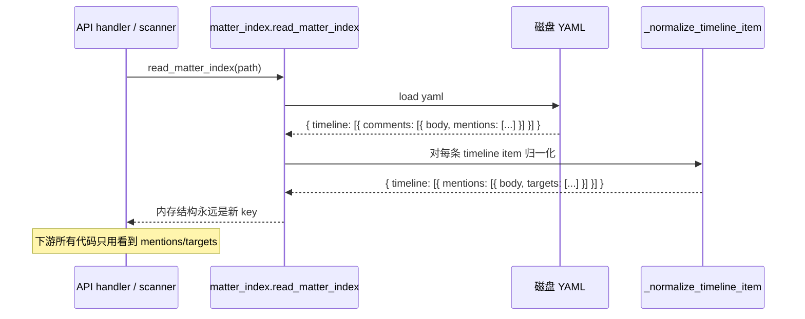
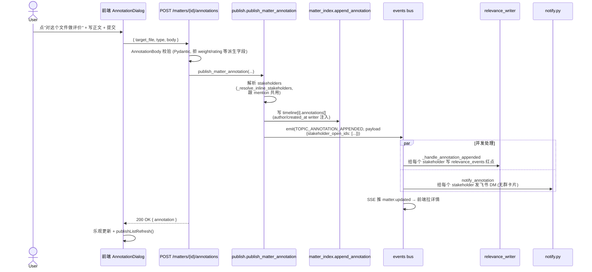

# matter index 数据模型重构：mentions / annotations 双层

> **版本：V2（2026-05-06 重订）**
> V1 只做了 `comments → mentions` 改名，漏了 annotation 落地和 stakeholder 通知规则两件需求；V2 一并补上。

## 一、需求背景

现在 matter index 的 timeline 里挂着一个 `comments` 数组，每条 comment 自己又带一个 `mentions` 数组。这个结构其实一直在干两件事：

1. 留一段话、@ 几个人，希望对方看到——这是**协作信号**。
2. 想对这个文件给个评价、做个判断——这是**评价标注**。

两件事被塞进了同一个字段，时间长了大家都心知肚明它叫什么不重要、反正用着用着就乱了。dengke 在 003_dengke_think 里把这事挑出来了：第一类——纯协作信号——独立出来叫 `mention`；第二类——评价标注——独立出来叫 `annotation`，不再混着用。

所以这一期要做两件配套的事：

- **rename**：`comments` 改名为 `mentions`，内层 `mentions` 改名为 `targets`，把"协作信号"这一层语义彻底锁死。
- **新增 annotation**：在 timeline 的每个文件项下面新挂一个 `annotations` 数组，承载用户对这个文件的明确评价。两层平行存在，互不干扰。

为什么要把它们打包做？因为只做 rename 等于把"评价"概念更深地藏进了 `mentions` 里——用户和 AI 都没有明确的字段去表达"这是个评价"。同时引入 `annotation`，rename 才有意义：mention = 提醒，annotation = 评价，从此说清。

为什么这么个事还要写设计文档？因为 `comments` 这个词在代码里出现的位置非常多——后端 schema、Pydantic body、HTTP 路由、事件总线 topic、飞书通知方法、MCP tool schema、前端类型、组件里全是。一动就是几十处，加上历史 YAML 还堆了一大堆 `comments:` 数据；annotation 又是个全新字段，前后端 / API / MCP / 渲染层都要新增入口。怎么改不出乱子需要先把节奏定清楚。

## 二、目标

讲四件事就够了：

- **写侧契约一刀切**：HTTP 路由、Pydantic 模型、事件 topic、MCP schema 全部直接改名，不留 alias、不做兼容转发。前后端**同批部署**，MCP 集成方已提前同步切换计划。
- **读侧做兼容**：matter_index reader 同时认 `comments` 和 `mentions` 两种 key，老 YAML 不需要迁移就能正常读出来、渲染、跑通知。
- **统一 stakeholder 通知规则**：mention 和 annotation 都按同一组规则给"工作相关方"发飞书 DM + 写红点——三个固定角色：被操作文件的 creator、matter.owner、matter.creator（去重 + 排自己）。mention 在此基础上额外通知它显式 @ 的 targets（保留原有"@ 谁就通知谁"语义）；annotation 没有 @ 概念。
- **新增 annotation 字段**：用户能给任意文件留下一段自然语言评价；AI 派生评分（weight / rating / sentiment …）**不在本期**——annotation 只存原始评价，派生层独立排期。

不在本期范围的事（避免 PR 失控）：AI 派生评分层、评价对象是否限定 `matter.owner`、`mention_unread_for_me` 字段名调整、cross-matter 评价（annotation 当前只挂在被评价文件所在 matter 的 timeline 上）。

> **注意**：mention 的通知接收人会从过去的"file author/owner"扩到"file.creator + matter.owner + matter.creator"——这意味着 mention 这一层不再是纯字段改名，而是**收件人范围扩大**。落地时需要回归一遍"在某文件下留言但不 @ 任何人"的场景，确认 matter.owner / matter.creator 收得到 DM。

## 三、技术方案

### 3.1 数据模型怎么变

YAML 上其实就一个改名加一个改名：

```yaml
# 改名前
timeline:
  - file: 002_liuyu_act_xxx.md
    comments:
      - body: "你看看这个方案"
        mentions: [liuyu]

# 改名后
timeline:
  - file: 002_liuyu_act_xxx.md
    mentions:
      - body: "你看看这个方案"
        targets: [liuyu]
```

外层 `comments` → `mentions`，内层 `mentions` → `targets`。**为什么不复用 `mentions` 这个名字到内层**？因为这样会出现 `mentions[].mentions` 这种递归式的怪结构，读代码的人第一眼会犯困。`targets` 直白：被提醒的人是谁。

### 3.2 写侧：直接切，不留兼容

写侧涉及的"对外契约"有四类：

| 契约 | 旧 | 新 | 兼容策略 |
|------|----|----|---------|
| HTTP 路由 | `POST /api/matters/{id}/comments` | `POST /api/matters/{id}/mentions` | 直接改名，无 alias |
| Pydantic body | `CommentIn` / `CommentBody` | `MentionIn` / `MentionBody` | 直接改名 |
| 事件总线 topic | `TOPIC_COMMENT_APPENDED` | `TOPIC_MENTION_APPENDED` | 直接改名 |
| MCP tool schema | `comment` / `comments` 参数 | `mention` / `mentions` 参数 | 直接改名 |

四个都不留 alias 是为了避免一个常见陷阱：兼容代码一旦上线就很难删掉，每隔一段时间就会有人问"那个旧的还在用吗"，最后变成永久负担。这次直接干净切换，代价是前后端必须同批发；MCP 集成方已提前打过招呼、约好了切换时间窗。

### 3.3 读侧：双键归一化是唯一的兼容层

写侧虽然干净切了，但磁盘上躺着的几十 / 几百个历史 matter 的 YAML 文件全是 `comments:` 开头的。这些 YAML 是用户的历史数据，不能也不该让它们坏掉。

兼容点放在**唯一的位置**：`server/matter_index.py` 的 reader。读出来之后立即做归一化：

```python
def _normalize_timeline_item(item: dict) -> dict:
    # 老字段在的话，搬到新字段；新字段已经在的话，原样走
    if "comments" in item and "mentions" not in item:
        item["mentions"] = item.pop("comments")
    for m in item.get("mentions") or []:
        if "mentions" in m and "targets" not in m:
            m["targets"] = m.pop("mentions")
    return item
```

这样做的好处：

- **下游所有代码只看到 `mentions` / `targets`**，不需要在 N 处分别处理两种 key。
- 内存里就一种结构，序列化回写出去自然就是新格式（用户改一次 matter，老 YAML 自然升级）。
- reader 是唯一兼容点，未来想清理的时候删一个函数就行。

写侧 validator 那边照常严格——只接受 `mentions` + `targets`，传 `comments` 直接 422。这是因为写侧拿到的请求都是新前端（或新 MCP 客户端）发的，不应该再有老 key。

### 3.4 飞书通知文案

`notify.py` 里凡是出现"评论"的位置改成"提醒"。例如：

- "X 在文件 Y 评论了你" → "X 在文件 Y 提醒了你"
- "X 评论了你的文件 Y" → "X 在你的文件 Y 留言提醒"

具体措辞 PR review 时再敲，本设计只规定方向。

### 3.5 一个反复出现的问题：`mention_unread_for_me` 这个字段名要不要一起改？

不改。这个字段是给前端 timeline item 加的衍生字段，含义是"这条 mention 是否对我未读"。改它意味着前端所有 `c.mention_unread_for_me` 都要跟着动，而且后端 `_inject_relevance` 里产出这个字段的位置也要联动。这一期范围明确不动，避免越改越大。

### 3.6 annotation 是什么、怎么落

annotation 跟 mention 平行挂在每个 timeline 文件项上，专门承载**用户对这个文件的评价**。形态上跟 mention 长得很像，但语义和触发的下游行为完全不同。

YAML 形态：

```yaml
timeline:
  - file: discussions/Pivot/xxx/002_liuyu_act_xxx.md
    creator: liuyu
    type: act
    summary: ...
    mentions:
      - created_at: '2026-05-06T09:50:00+08:00'
        body: "你看看这个方案"
        targets: [liuyu]
        author: dengke
    annotations:
      - created_at: '2026-05-06T10:22:00+08:00'
        type: evaluation
        author: dengke
        body: "这个方案判断很准，提前识别了权限边界问题，后面实施也基本按这个思路走通了。"
```

**字段顺序（落盘 canonical 顺序，由 writer 保证稳定）**：

- mention：`created_at, body, targets, author` —— 与现有 comments[] 形态一致（看 `var/git/test-discuss/index/*.index.yaml` 的实际产出可印证），改名后内/外 key 跟改、顺序保持
- annotation：`created_at, type, author, body` —— 跟 mention 同样把 `created_at` 放最前面方便按时间扫描；`type` 紧跟，让"这是个评价"先于内容显示出来


字段约束：

| 字段 | 必填 | 说明 |
|------|------|------|
| `type` | 是 | 当前固定值 `evaluation`；预留 `correction` / `note` 等扩展，落地新值需要走升级流程，writer schema 拒未知值 |
| `author` | 是（writer 自动填） | 评价者 pinyin。**和 mention 的 `author` 同名同义**——历史上"圈人 / 留言"路径就是用 `author` 表示"这条 inline 数据是谁写的"；annotation 是同一类 inline 数据，沿用 `author` 保持一致。`creator` 这个字段名被 timeline 文件项占用了（含义是"谁创建了这个文件"，文件级语义），不复用。writer 从登录态注入，client 不允许传 |
| `created_at` | 是（writer 自动填） | ISO 时间戳，writer 注入 |
| `body` | 是 | 自然语言评价正文。`min_length=1`、`max_length=2000`，与 mention.body 同口径 |

**target 怎么表达？** annotation 不需要 `target` 字段——它本身就挂在被评价文件的 timeline 项下，目标隐含为同一项的 `file`。这跟 dengke 原文里的"target: discussions/.../xxx.md"做了简化：v1 不支持跨 matter 评价，所以 target 退化为隐式。v2 如果要做跨 matter 评价，再引入显式 target + 顶层 annotations 容器。

**显式不收什么。** annotation 落盘**只有自然语言**——`weight` / `rating` / `dimension` / `sentiment` / `score_delta` 这些字段一律拒收（Pydantic `extra="forbid"` + writer schema 双重把关）。理由（夹带 dengke 原话）：

- weight 应该来自组织身份和系统配置（CEO / CTO / 负责人 / 普通成员），不是评价者自己填，否则没治理意义。
- rating 不让人直接打分。不同人的尺度差异大，上级也可能不好意思给低分，最后变成人情分。
- 这些派生指标由 AI 评分系统在独立的"派生评分层"产出，存到 scoring 模块自己的表里，**不跟原始 annotation 同表**。

**触发什么、不触发什么。** annotation 写入路径：

- ✅ 写 timeline 文件项的 `annotations[]`
- ✅ emit `TOPIC_ANNOTATION_APPENDED` 内部事件，触发 SSE 推 `matter.updated`，前端刷新该 matter 详情
- ✅ `author` 走 mention 同款解析链，渲染时注入 `author_display` / `author_view`（与 mention.author 完全对称）
- ✅ **通知三个固定 stakeholder**（飞书 DM + relevance_events 红点同时写）——这是 mention 和 annotation **共用**的规则，由 `_resolve_inline_stakeholders(matter_data, target_file, *, actor)` 解析：
  1. **被操作文件的 creator**（`timeline[i].creator`，谁写了这个文件）
  2. **matter 的 owner**（`matter.owner`，当前谁负责推进）
  3. **matter 的 creator**（`timeline[0].creator`，谁发起了这件事）

  收件人取这三人的并集，去重；`actor`（annotation 的 author）永远从集合里排除（不通知自己）。如果某个角色解析不出来（matter.owner 缺、creator 是未注册联系人没 open_id 等），就跳过那一个，其他正常发。
- ❌ **annotation 没有 @ 概念**——上面那批通知是"工作相关方知会"，不是用户主动 @ 谁。annotation 不会出现 mention 那种"显式 @ targets 额外发群卡片"分支。前端 AnnotationDialog 不出 @ 选择器。
- ❌ **不 bump matter.updated_at**（跟 mention 一致，annotation 是讨论材料，不是 matter 进展）

**为什么要通知这三个角色？** 评价是工作反馈的核心信号——文件作者需要知道有人评他的工作；matter owner 需要知道事项里出现了评价（可能涉及推进决策）；matter creator 是发起者，对全程评价应该有感知。这三个人是工作语义上的天然利益相关方，不通知反而反常。同样的逻辑也适用于 mention（在某文件下留言，stakeholder 也该知道），所以两套路径共用解析。

**为什么 annotation 没有群卡片？** mention 在 @ targets 时发群卡片是公开喊人的语义；annotation 是私下评价（虽然落盘公开可见），DM 给三个相关方就够，不需要在群里再 broadcast 一遍。

API：

| 资源 | 方法 + 路径 | body |
|------|------------|------|
| 新增评价 | `POST /api/matters/{id}/annotations` | `{ target_file, type, body }` |

只有"加"，没有"改"也没有"删"。前端入口同样只有"写一条评价"按钮，不出现"删除"操作。

MCP tool 镜像同一个端点：`add_annotation`，schema 和 HTTP body 一致。

### 3.7 mention 与 annotation 边界对照

落地时大家最容易混的就是这两个。一张表说清：

| 维度 | mention | annotation |
|------|---------|-----------|
| 目的 | 提醒、拉人参与、要求回应 | 对工作事实做评价、判断、补充 |
| stakeholder DM（共同规则） | DM 给 file.creator + matter.owner + matter.creator（去重 + 排自己） | 同 mention，完全一致 |
| 额外通知 | DM + 群卡片给所有显式 @ targets | 无（annotation 没有 @） |
| 是否写红点 (relevance_events) | stakeholder 三角色 + 显式 @ targets | 仅 stakeholder 三角色 |
| 是否 bump matter.updated_at | 否 | 否 |
| 关键字段 | body + targets | type + body |
| 写入者字段名 | `author` | `author`（同 mention；`creator` 在 timeline 里专指"文件创建者"，不复用） |
| 写入者来源 | 登录态（writer 注入） | 登录态（writer 注入） |
| 删除 / 编辑 | v1 都不支持 | v1 都不支持（要改就再写一条新的）|
| AI 怎么用 | 弱信号（情绪 / 活跃度） | 评分系统的核心证据 |

**为什么 mention 也按这个规则发？** 旧实现里 mention 只通知"file author/owner"两个人，看似克制，但漏掉了 matter.owner（事项当前负责人）和 matter.creator（事项发起人）——这俩才是事项推进里最该关注新动向的人。统一规则后：mention 跟 annotation 共享"工作相关方知会"的地基，差别只在于 mention 多了个"显式 @ 谁就额外通知谁"的语义。代码上对应 `_resolve_inline_stakeholders(matter_data, target_file, *, actor)` 一个公用 helper（mention 和 annotation 的 publish 都调它）。

如果用户/AI 拿不准——"我是想叫某人来看，还是要给个评价"——产品决策建议：**带 @ 就一定是 mention，没 @ 但带评价语气就是 annotation**。前端入口要拆成两个按钮，不要让用户在同一个输入框里靠语气区分。

## 四、时序图

### 4.1 写一条 mention 的端到端流程

```mermaid
sequenceDiagram
    actor User
    participant FE as 前端 FileCard
    participant API as POST /matters/{id}/mentions
    participant Pub as publish.publish_matter_mention
    participant Idx as matter_index.append_mention
    participant Bus as events bus
    participant Rel as relevance_writer
    participant Notify as notify.py

    User->>FE: 点 @人 + 留言 + 提交
    FE->>API: { target_file, body, targets: [open_id...] }
    API->>API: MentionBody 校验 (Pydantic)
    API->>Pub: publish_matter_mention(...)
    Pub->>Pub: 解析 stakeholders<br/>(file.creator + matter.owner + matter.creator,<br/>去重 + 排自己;<br/>共用 _resolve_inline_stakeholders)
    Pub->>Idx: 写 timeline[i].mentions[]<br/>(targets 已 resolve 成 pinyin/open_id)
    Pub->>Bus: emit(TOPIC_MENTION_APPENDED, payload<br/>{stakeholder_open_ids, target_open_ids})
    par 并发处理
        Bus->>Rel: _handle_mention_appended<br/>给 stakeholders + targets 写红点
    and
        Bus->>Notify: notify_mention<br/>给 stakeholders 发 DM<br/>+ 给 targets 发 DM + 群卡片
    end
    API-->>FE: 200 OK
    FE->>FE: 乐观更新 + publishListRefresh()
```

### 4.2 读一个老 matter（reader 双键归一化）



老 YAML 在内存里被改写成了新结构；如果接着这次读取触发了一次写回（比如用户在这个 matter 里追加了一条新 mention），落回磁盘的就是新格式，老 YAML 就此自然升级。**不主动批量改写历史文件**——靠用户的自然交互慢慢迁。如果以后想彻底清理 reader 这层兼容代码，到时候跑一次性 rewrite 脚本扫一遍就行。

### 4.3 写一条 annotation 的端到端流程

跟 mention 路径**几乎完全一样**——共用 `_resolve_inline_stakeholders` 解析三角色、共用同一套写红点 + 发飞书 DM 的并发分支。区别只有两点：

- annotation **没有 @ targets**——因此跳过"@ 解析 + 群卡片"那一支（mention 在 `_resolve_mention_strings_to_open_ids` + `notify_standalone_mention` 里做的事，annotation 全没有）
- annotation 走自己的 events topic（`TOPIC_ANNOTATION_APPENDED`）和自己的 notify 卡片模板（`notify_annotation`），这样订阅方 / 文案能区分两类



故意没画的事：

- **没有 ambiguous_mention 422 分支**——annotation 不解析 @-target，stakeholder 是从 timeline / matter.owner 直接读出来的，不会有歧义
- **没有群卡片**——只发 DM。annotation 是私下评价，不刷群

## 五、影响面速览

只列文件层面的热点，每个文件具体怎么改在实施计划里。两块改动平行进行：rename 影响的是既有代码、annotation 引入的是新代码。

### 5.1 mentions rename 影响

后端：

- `server/matter_validator.py`、`server/publish.py`、`server/api/matters.py`
- `server/notify.py`、`server/events.py`、`server/mcp/schemas.py`
- `server/relevance_writer.py`、`server/relevance_scanner.py`
- `server/matter_index.py`（reader 兼容点的核心位置）
- **`server/publish.py` 新增 `_resolve_inline_stakeholders(matter_data, target_file, *, actor)`**——解析 file.creator + matter.owner + matter.creator 三角色（去重 + 排 actor）。mention 路径里把原来的 `_resolve_file_author_recipients`（只算 file 作者）替换成它，让 mention 也能通知到 matter.owner / matter.creator。这是统一 stakeholder 规则的核心抓手，annotation 也复用这个 helper

前端：

- `web/src/api.ts`（类型 + API client）
- `web/src/components/matter/FileCard.tsx`、`MentionPopover.tsx`
- `web/src/pages/MatterDetailPane.tsx`
- 其他 grep `comments` / `comment_` 拉出来的所有引用

测试：

- 所有 `*comment*` 测试文件改名 + 断言改 key
- **`server/tests/test_publish.py` 加 `_resolve_inline_stakeholders` 单测**（去重 / 排自己 / 缺角色降级）
- **`server/tests/test_relevance_writer.py` 增强 mention 用例**：在某文件下留言不 @ 任何人时，matter.owner 和 matter.creator 也应该收到红点
- **`server/tests/test_notify.py` 增强 mention 用例**：同上场景，matter.owner 和 matter.creator 也应该收到 DM

### 5.2 annotation 新增涉及

后端：

- `server/matter_index.py`：新增 `append_annotation`；`_ITEM_KEY_ORDER` 加 `annotations`；新增 `_canonical_annotation`
- `server/matter_validator.py`：annotation schema 校验（type 白名单、body 长度、拒派生字段）
- `server/publish.py`：新增 `publish_matter_annotation`；**复用 §5.1 引入的 `_resolve_inline_stakeholders`**（同一 helper，mention 和 annotation 共用），调用结果喂给 notifier 和 emit payload
- `server/api/matters.py`：新增 `POST /matters/{id}/annotations`、Pydantic `AnnotationBody`
- `server/events.py`：新增 `TOPIC_ANNOTATION_APPENDED`
- `server/api/matters_events.py`：把上面 topic 映射到 SSE `matter.updated`
- `server/relevance_writer.py`：新增 `_handle_annotation_appended`——订阅 `TOPIC_ANNOTATION_APPENDED`，给 payload 里的每个 stakeholder 写 `kind=annotation` 红点
- `server/relevance_events.py`：新增 `KIND_ANNOTATION = "annotation"` + `insert_annotation(...)` 仓库方法（schema 不动，只是 kind 列多一个枚举值）
- `server/notify.py`：新增 `notify_annotation(...)` 方法 + 对应卡片 builder（飞书 DM 模板，无群卡片）；卡片文案"X 在 matter『...』里评价了你的文件 / 你负责的事项"
- `server/mcp/schemas.py` + `server/mcp/tools.py`：新增 `add_annotation` 工具
- `server/api/matters.py::_render_item`：渲染时把 annotations[] 一并返回，每条注入 `author_display` / `author_view`（复用 mention.author 同款解析链）

前端：

- `web/src/api.ts`：新增 `TimelineAnnotation` 类型；`TimelineFileItem.annotations` 字段；`appendMatterAnnotation` API
- `web/src/components/matter/FileCard.tsx`：渲染 annotations 区块（独立于 mentions 区，视觉上要区分得出来）
- `web/src/components/matter/AnnotationDialog.tsx`：**新建**评价输入弹窗（不带 @ 选择器，明确区分于 MentionPopover）
- `web/src/events/types.ts`：SSE 事件名照旧用 `matter.updated`，订阅者无感
- 红点角标：annotation 红点跟现有 file/mention 红点共用 `unread_breakdown_per_matter` 聚合，前端不需要单独区分（用户视角"matter 里有事找我"是统一的）

测试：

- `server/tests/test_matter_index.py`：annotation 写 / 读 / canonical 顺序
- `server/tests/test_matter_validator.py`：annotation 字段校验、拒派生字段
- `server/tests/test_matters_api.py`：annotation 端到端、`author` 自动注入（client 传 author 应被忽略或 422）
- `server/tests/test_publish.py`：`_resolve_inline_stakeholders` 单测在 §5.1 已加，annotation 这边只需补一条 publish_matter_annotation 端到端用例验证调用路径走通
- `server/tests/test_relevance_writer.py`：annotation appended → stakeholder 们都拿到 `kind=annotation` 红点；author 自己不拿
- `server/tests/test_notify.py`：annotation appended → 三个 stakeholder 各拿一条 DM；author 自己不拿
- `server/tests/test_mcp_tools.py`：add_annotation 工具

## 六、实施分工

按"做什么"分而不是按"谁来"分（具体到人由 PM 排）。整个改造拆 6 个 Phase——前 5 个是 mentions rename，第 6 个是 annotation 引入，分别独立 PR。

| 角色 | 主要职责 | 涉及 Phase |
|------|---------|-----------|
| 后端基础设施 | reader 双键归一化、validator schema 改名、新增/改造测试 fixture | Phase 1 |
| 后端业务 | publish / API / Pydantic 改名，路由直接切，跑通后端测试 | Phase 2 |
| 后端集成 | events topic、relevance handler、notify 文案、MCP schema 改名 | Phase 3 |
| 前端 | 类型、API client、FileCard / MatterDetailPane 字段访问改名 | Phase 4 |
| 文档 | pivot-interface / CLAUDE.md / README 同步；留一次性 rewrite TODO | Phase 5 |
| **annotation 全栈** | matter_index 写读 + validator + publish + API + MCP + 前端 AnnotationDialog + 测试 | **Phase 6** |
| 联调 / 测试 | 真实飞书通知回归（@ 自己 / 不 @ / AI 自动 @）、老 YAML 兼容、annotation 端到端 | 跨 Phase |

部署节奏上有一个硬约束：**Phase 2（后端路由）和 Phase 4（前端 API client）必须同批发**。后端先发的话，前端旧版本调旧路由会 404；前端先发的话，新前端调新路由会 404。其他 Phase 都可以独立部。

**Phase 6 (annotation) 可以放在 Phase 1-5 跑稳之后再独立排期发布**——它是纯新增，不破坏既有契约。也允许跟 Phase 4 一起发，前端只是多了一个新 dialog。建议晚一周上，让 mention rename 先稳住再叠加新功能。

MCP schema 改名（Phase 3）会立刻破坏外部 AI 集成（Claude Code 等），**已和 MCP 开发人员同步切换计划**。落地时仍需保证：

- Phase 3 上线时间与 MCP 集成方约定的切换窗口对齐
- 上线后第一时间在 MCP tool description 里把新字段写清楚
- 留一份切换公告，注明老字段已下线、新字段为 `mention` / `mentions`
- Phase 6 上线时同步通知 MCP 集成方新增 `add_annotation` 工具

## 七、风险与回滚

### 7.1 mentions rename

主要风险只有一个：**写侧不留 alias，万一上线后发现某个客户端没跟上，会立刻 404**。

应对：

- 上线前先在测试环境跑一次完整链路（创建 mention / 看 timeline / 收飞书 / @-未读红点）。
- Phase 2 + Phase 4 走同一个发布窗口、共用一个回滚开关。
- 万一线上出问题，回滚就是把后端和前端一起 revert，不存在"只 revert 一边"的中间态。
- MCP 切换计划已与开发人员对齐，按约定窗口同步发布。

读侧兼容是单点，归一化函数有完整 unit test 覆盖，老 YAML 渲染、@ 通知、AI 复盘都有 fixture。线上跑 1-2 周如果没问题，就可以排期一次性 YAML rewrite（独立 PR），跑完后才能删 reader 这层归一化。


## 八、验收

参考实施计划，分两块看：

**mentions rename**：

1. 新写入的 YAML 全部以 `mentions:` 开头。
2. 旧 matter（只含 `comments:`）能正常读、能正常 @、能收到飞书提醒，**字段层面对比改名前 0 diff**。
3. **stakeholder 通知规则生效**：在某文件下留言（不 @ 任何人），matter.owner 和 matter.creator 也能收到飞书 DM 和 relevance 红点（如果不是 author 本人）。这是**行为变化**，需要专门手测一遍并补单测。
4. 后端测试全绿、前端 `pnpm tsc --noEmit` 0 错误。
5. MCP 集成方切换完成、Claude Code 等外部调用方对得上新字段。

**annotation 引入**：

6. 用户能从 FileCard 入口写 annotation，落进 YAML 的 `annotations[]`，`author` / `created_at` writer 自动注入（client 不允许传，传了被忽略或 422）。
7. annotation body 里夹带 `weight` / `rating` / `dimension` 等派生字段会被 Pydantic 拒（422）；writer schema 兜底（dict 即使绕过 Pydantic 也拒）。
8. annotation 写入**走与 mention 相同的 stakeholder 通知规则**（同一个 helper `_resolve_inline_stakeholders`）：file.creator + matter.owner + matter.creator，去重 + 排自己；author 自己不收。**不 bump matter.updated_at**、**不发群卡片**。
9. 没有 DELETE 路由，没有删除按钮，没有 MCP 删除工具——grep 检查 + 路由列表检查双重确认。
10. MCP `add_annotation` 工具能从 Claude Code 调通，schema 与 HTTP 一致。
