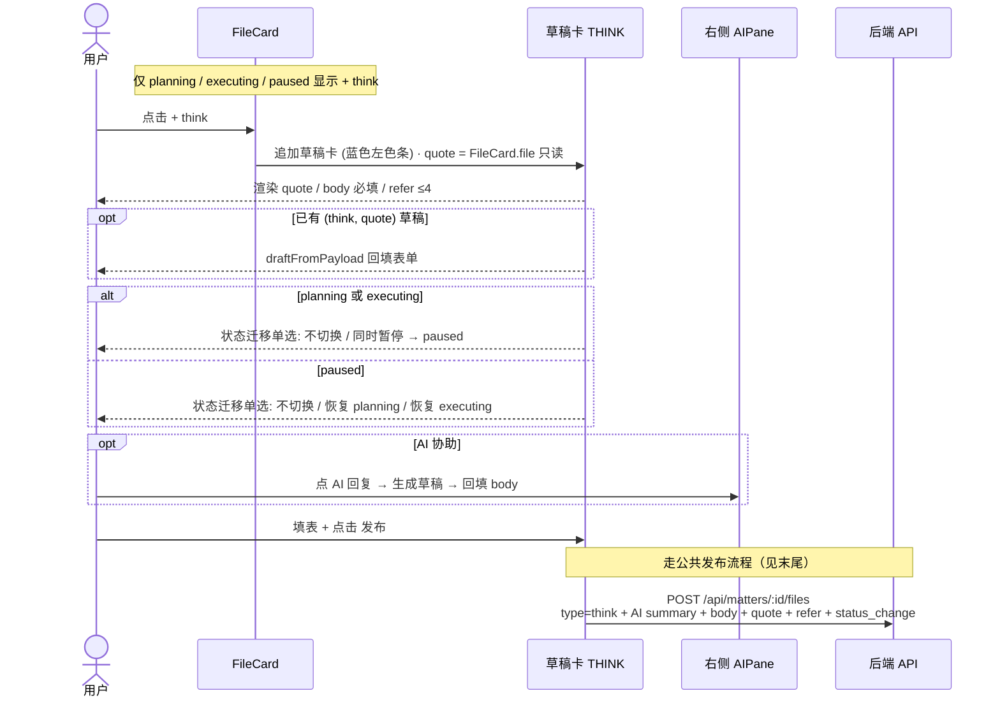
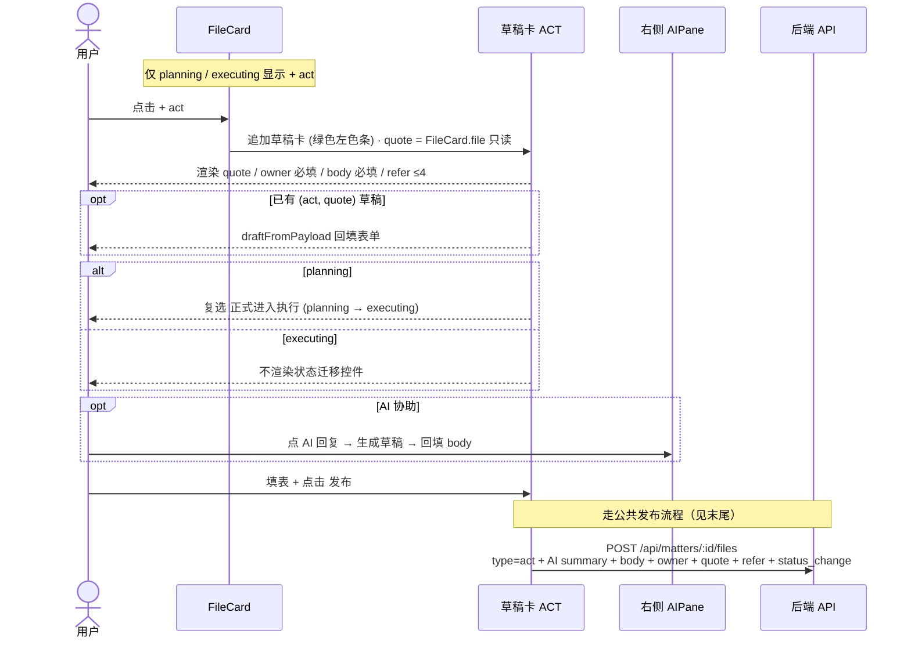
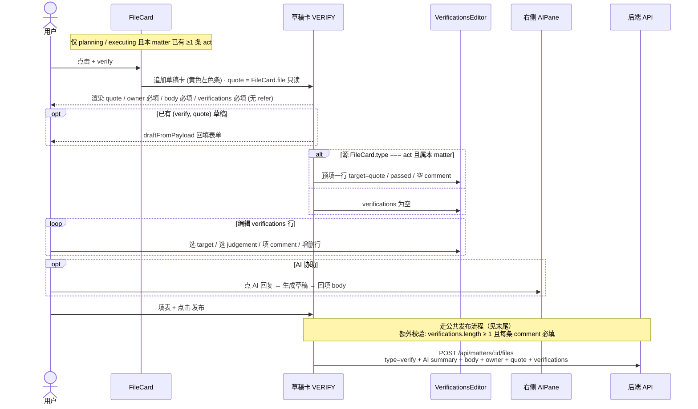
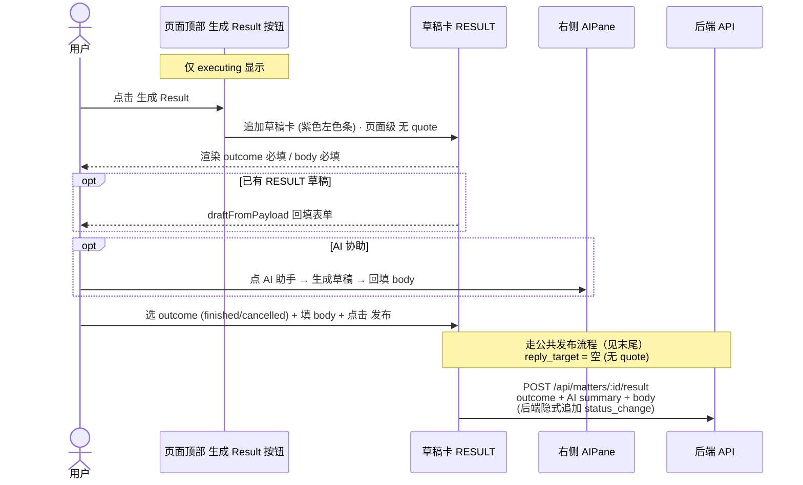
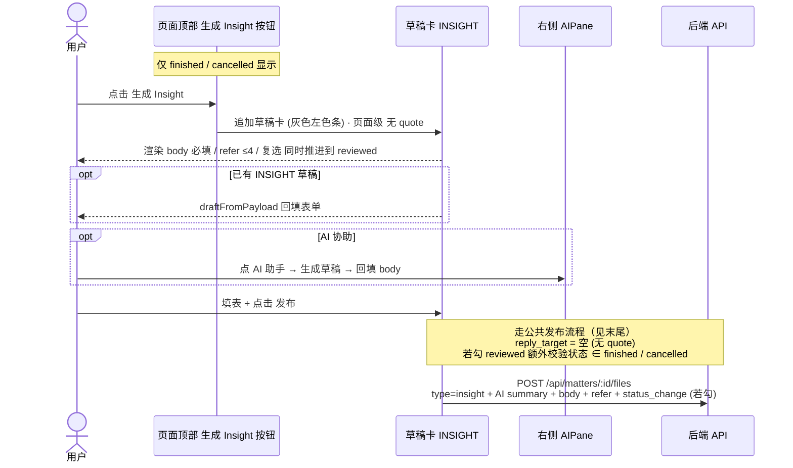
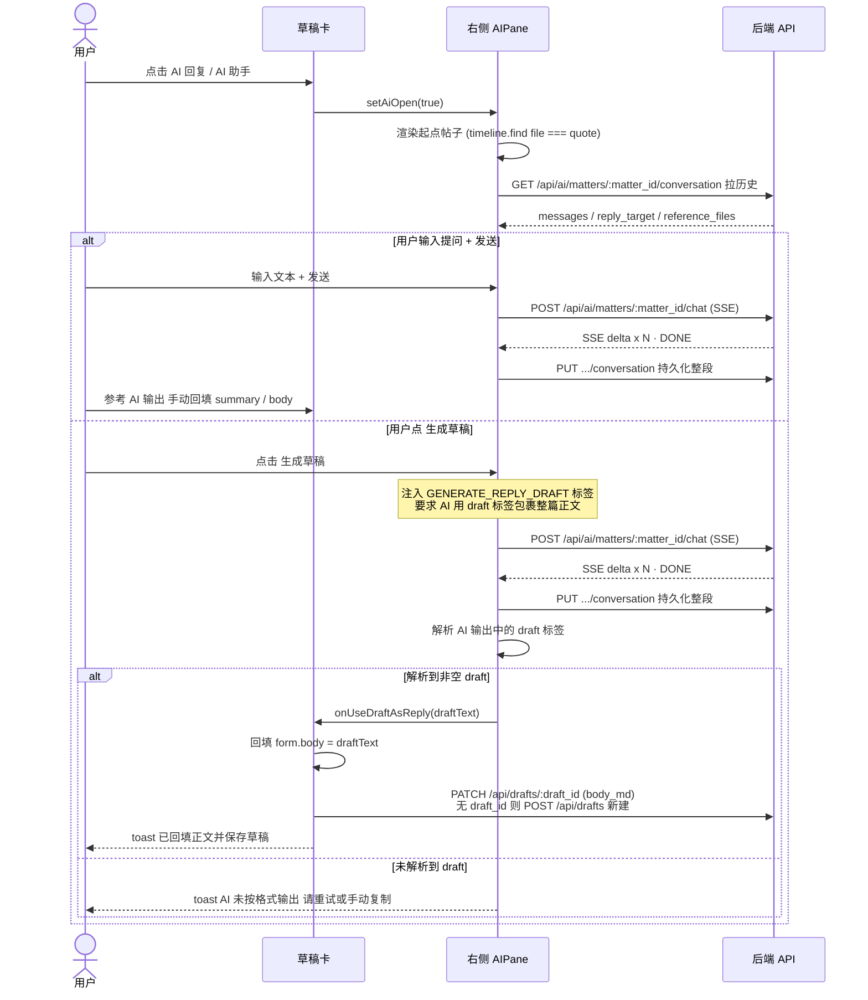

# 五类卡片创建/发布交互时序合集

## 速览：文档类型 × matter 状态

**5 类文档**：

| type | 作用 |
|---|---|
| `think`   | 分析、澄清、方案推演、暂停说明 |
| `act`     | 行动方案、执行记录 |
| `verify`  | 对一组 act 的验证判断 |
| `result`  | matter 最终正式结果（finished / cancelled） |
| `insight` | 复盘、经验、可复用认知 |

**6 个 matter 状态 + 各自允许的文档类型**：

| current_status | 含义 | 允许新增 |
|---|---|---|
| `planning`  | 计划中 | think / act / verify |
| `executing` | 执行中 | think / act / verify (+ result) |
| `paused`    | 暂挂 | **只允许 think** |
| `finished`  | 完成 | 只允许 insight |
| `cancelled` | 取消 | 只允许 insight |
| `reviewed`  | 复盘收口 | — 终态，不再新增 |

主链：`planning → executing → finished | cancelled → reviewed`；`think` 是 `paused` 进出的唯一通道。

---

## ① THINK 卡片

> [!IMPORTANT]
> **⚠️ 特别提醒 · 触发状态变更的参数：状态迁移单选组**
> - `不切换状态` (默认) → matter 状态不变
> - `同时暂停` → planning / executing → **paused**
> - `恢复为 planning` → paused → **planning**
> - `恢复为 executing` → paused → **executing**
>
> （think 是 paused 进出的唯一通道）

---

## ② ACT 卡片

> [!IMPORTANT]
> **⚠️ 特别提醒 · 触发状态变更的参数：复选 `正式进入执行`**（仅 planning 状态时显示）
> - 勾选 → planning → **executing**
> - 不勾 → matter 状态不变

---

## ③ VERIFY 卡片

> [!NOTE]
> **状态变更说明**：verify 不携带 status_change，**任何参数都不会触发状态变更**，matter 状态保持 executing。

---

## ④ RESULT 卡片（页面级）

> [!WARNING]
> **⚠️ 特别提醒 · 触发状态变更的参数：`outcome` 单选**（必填 · **发布即必然触发**）
> - `finished` → executing → **finished**
> - `cancelled` → executing → **cancelled**
>
> status_change 由后端 `append_result` 隐式追加，前端不组装；result 是 matter 收口动作，落盘后不可撤回。

---

## ⑤ INSIGHT 卡片（页面级）

> [!WARNING]
> **⚠️ 特别提醒 · 触发状态变更的参数：复选 `同时推进到 reviewed`**
> - 勾选 → finished / cancelled → **reviewed**（终态，**不可逆**）
> - 不勾 → matter 状态不变

---

## 公共发布流程（点 `发布` 后五段执行）

1. **前端校验**必填字段；任一不通过 → toast 错误，停在草稿卡
2. `stage = generating`，按钮显示 **AI 生成中**
3. `streamAIChat` → `POST /api/ai/matters/:matter_id/chat`（SSE）
   - 流出错 / 超时 → toast 失败、`stage = idle`
   - SSE delta 累加得到 summary
   - summary 为空 → toast 失败、`stage = idle`
4. `stage = publishing`，按钮显示 **发布中**
5. POST 落盘
   - think / act / verify / insight → `POST /api/matters/:id/files`
   - result → `POST /api/matters/:id/result`
6. 成功 → toast 成功、清理 pendingCreate / pendingDraftId / pendingInitial、`fetchMatter` 刷新时间轴

---

## 五类速查表

| 维度 | think | act | verify | result | insight |
|---|---|---|---|---|---|
| 入口位置 | FileCard 卡级 | FileCard 卡级 | FileCard 卡级 | 页面顶部 | 页面顶部 |
| quote | FileCard.file | FileCard.file | FileCard.file | 无 | 无 |
| owner | — | 必填 | 必填 | — | — |
| refer | ≤4 | ≤4 | — | — | ≤4 |
| 专属字段 | 状态迁移单选 | promote 复选 | verifications | outcome | 推进 reviewed 复选 |
| 状态前置 | planning / executing / paused | planning / executing | planning / executing 且有 act | 仅 executing | 仅 finished / cancelled |
| 落盘 endpoint | `/files` | `/files` | `/files` | `/result` | `/files` |
| 状态后置 | 不变 / paused 进出 | 不变 / → executing | 不变 | → finished/cancelled | 不变 / → reviewed |

---

## ⑥ AI 助手（通用 · 触发自所有草稿卡的 `AI 回复` / `AI 助手` 按钮）

### 约定速查

| 项 | 说明 |
|---|---|
| matter 维度 | 用 matter_id 作为唯一键；不同 matter 会话互相隔离 |
| 跨 matter 锁 | 前端单例 `activeStream`：同一时间只允许一个 matter streaming（后端无锁） |
| 生成 summary 链路 | 公共发布流程里的 streamAIChat 与本图共用 endpoint，但**不写 conversation**，只本地累加返回 |
